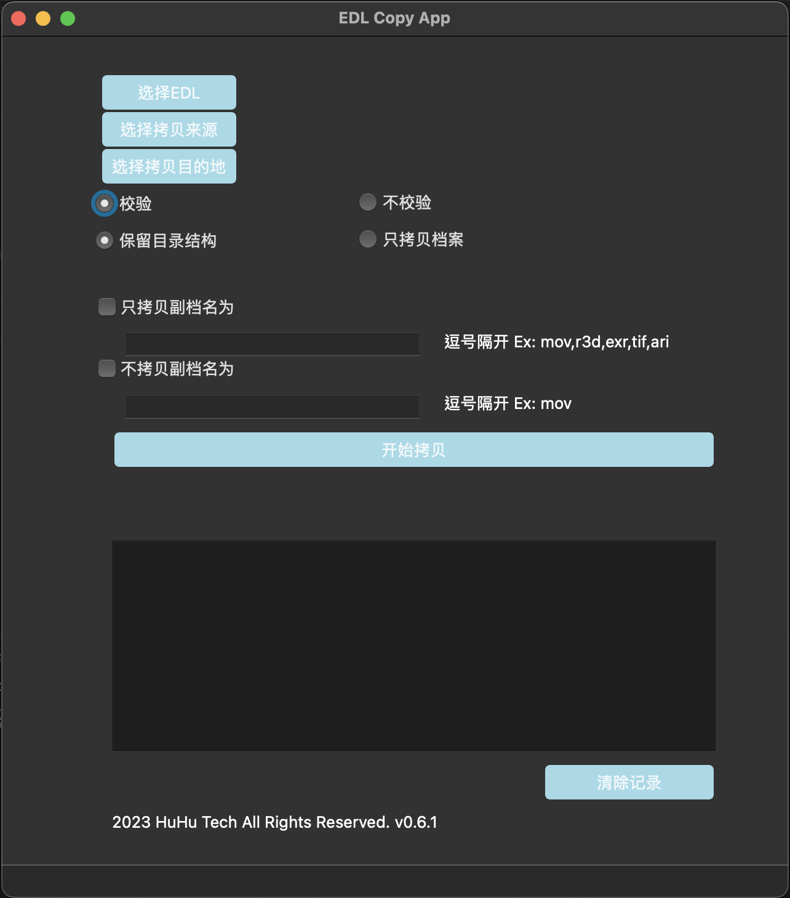

# 挑條拷貝工具
    把要拷貝的檔案名稱列在txt檔案中，或者EDL檔案中，

    指定來源資料夾，

    指定目的資料夾，

    按下Start，開始拷貝

    * 會自動移除檔案的副檔名
    * 使用rsync來拷貝檔案
## Screenshot

## Release Date & Version 

2023 02 10 v0.6.1

## Github

    https://github.com/gumpcpy/EDLCopy

    git push EDLCopy main
    

## Description
Qt Python App

Usage: Film Production/Post Production 

Copy Camera Raw Footages From Source to Destination

Input File Can Be Txt Files OR EDL Files

Extension Name would be removed

Use rsync OS Command to execute copy

Main Logic: gump_EDLCopy_CORE.py

UI: Layout.py

Entrance: gump_EDLCopy.py

### How to use:

python version 3.19

Install required packages in requirements.txt

python gump_EDLCopy.py
